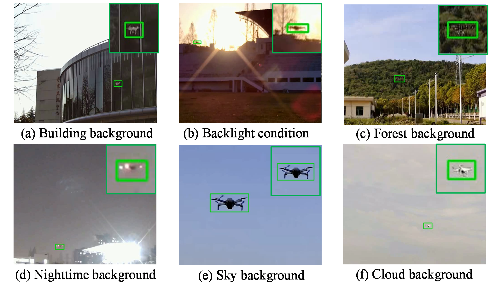
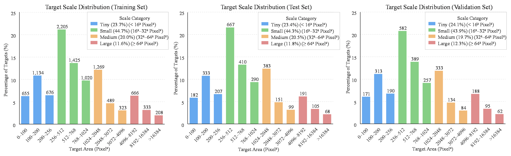

# LFE-UAV
# A Lightweight Feature-Fusion and Small-Target Enhancement Network for Vision-Based UAV Detection

## 1.Det-UAV Dataset

Det-UAV is a UAV detection dataset developed for ground-to-air vision scenarios. It is constructed based on the public **DroneDetectionDataset**: 10,000 images are retained from that dataset, while 6,287 newly collected images are added to improve the diversity of UAV scales, scenes, illumination conditions, and flight distances.

The dataset Det-UAV UAV detection dataset contains 10403 images for training, 2798 images for validation, and 3086 images for testing, with a total of 16287 images.

## 2.The dataset has been uploaded.
| Dataset  | Link |
| --- | --- |
| Det-UAV | [Link ( `viik`)](https://pan.baidu.com/s/1HB3NjHm41dF5HZ6Z94Vqag?pwd=viik) |
| DroneDetectionDataset | [Link](https://github.com/Maciullo/DroneDetectionDataset) |

## 3.Representative Scenes

## 4.Target-Scale Distribution

## Acknowledgements

We sincerely thank the authors of [DroneDetectionDataset](https://github.com/Maciullo/DroneDetectionDataset) for their contribution to UAV detection research.
